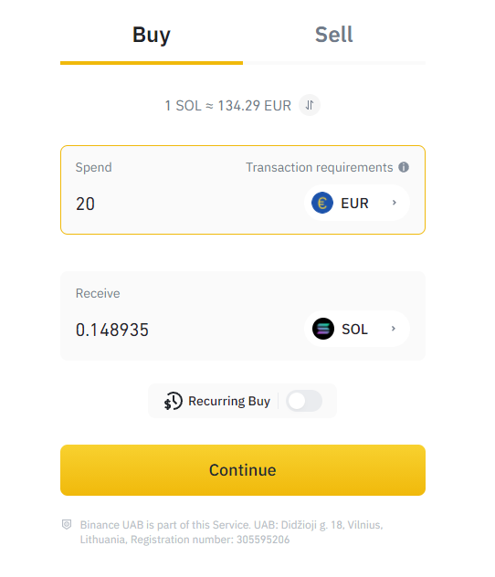
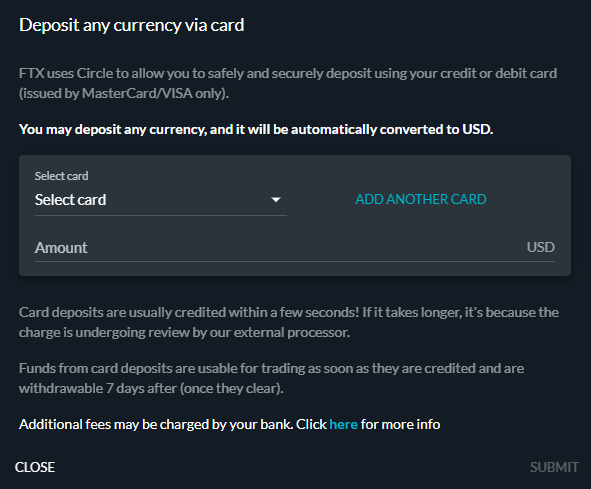

# How to Buy SOL

## 1. Find an exchange

In order to buy a cryptocurrency, you need to create an account on a platform called an exchange. Several options exist depending on where you live. Here is a non-exhaustive list of exchanges where you can create an account and buy SOL:&#x20;

* [Binance](https://www.binance.com/en)
* [Bithumb](https://en.bithumb.com)
* [Coinbase](https://www.coinbase.com)
* [FTX](https://ftx.com)
* [Huobi](https://www.huobi.com/en-us/)
* [Kraken](https://www.kraken.com)
* [Kucoin](https://www.kucoin.com)
* [OKX](https://www.okex.com)
* Etc.

A list of markets can be found on [Coingecko](https://www.coingecko.com/en/coins/solana#markets).


Be sure to do your own research before choosing an exchange. They will offer different services and fees and won't all be available in all countries. Nonetheless, you should be able to buy SOL in any country.&#x20;


## 2. Create your account


We will use FTX.com as an example for this tutorial, but most exchanges will require the same steps in order to buy SOL. If you find yourself having trouble at any point, head over to our [Discord](https://discord.com/invite/6EtUf4Euu6) and we will jump in to help you.&#x20;


In order to create your account, you will need to provide an email address and choose a secure password. Make sure you also enable 2FA (2-factor authentication) whenever possible.&#x20;

You will then (for most exchanges) have to complete KYC (Know Your Customer) by providing:&#x20;

* Your full name
* Your country of residency
* Your state, province, or region
* Your birthdate
* A valid phone number

This list is not exhaustive and different exchanges may ask for other information. Some exchanges won't require KYC at all for small transactions.&#x20;

Once this is completed (this can take from minutes up to a few days depending on the exchange you're using), your account will be validated. You will be able to deposit fiat currencies (dollars, euros, etc.) into your account or directly buy cryptocurrencies.&#x20;

## 3. Buy SOL

### 3.1 - Direct buy

Some exchanges will let you directly buy a cryptocurrency with your credit card or with a bank transfer. This is the case on Binance, for example. In this case, you simply have to enter the amount of money you want to spend and a payment window will appear.

### 3.2 - Trade for SOL

On other exchanges, you may not have the possibility to directly buy SOL. First, you will have to deposit fiat currency into your account.&#x20;

Find your wallet to deposit money into your selected exchange. If you're using FTX, your wallet is accessible by clicking on your username and you can only pay with a credit card.

You have now deposited USD into your FTX account. You can use the "Convert" button next to your USD balance in your wallet to convert it to SOL. If you agree on the price and click on "Convert", your USD will be converted to SOL that you will be free to trade or send to another wallet.&#x20;

### 3.3 - Other scenarios

Some exchanges won't let you directly trade fiat currency for SOL.&#x20;

If this is the case, you will need to find a third cryptocurrency that can be traded for SOL on the exchange. In most cases, you will be able to convert or trade your fiat currency to a stablecoin (USDT, USDC, BUSD, etc.) and use this stablecoin to buy SOL on the exchange. This will not be an issue whatsoever, it only mean you'll have to make one more trade.&#x20;

Make sure to check what cryptocurrencies can be exchanged for SOL on the exchange you are using before making your choice.

## 4. Welcome to the Solana network

Congratulations, you have now bought your first SOL tokens! It's time to head over to [Marinade's](https://marinade.finance/app/staking) kitchen to stake them, but for this you will need to create your own custodial wallet.

If you'd like to read more about Solana, please take a look their [documentation](https://docs.solana.com/introduction).


When you buy a cryptocurrency on an exchange, the platform guarantees that it is yours, but you do not have full control over it. If the exchange closes for example, you may not recover your funds. If you want to fully control your funds (and use them in DeFi), you need to move them to a[ custodial wallet](spl-wallet.md).

