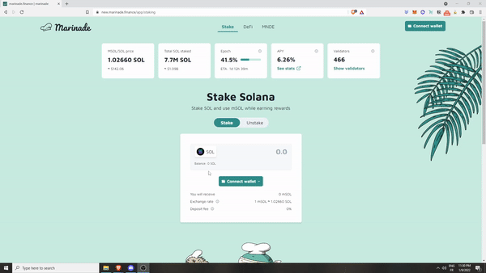

# How to Stake SOL

There are two ways to stake SOL on Marinade:&#x20;

1. **Stake SOL.** This is for users who want to start staking on Solana.&#x20;
2. **Deposit stake account.** This is for users who are already staking with a single validator and want to tokenize their already existing stake on Marinade.

## 1. Stake SOL

Staking your SOL on Marinade is as simple as it gets. All you have to do is:

1. Visit [https://marinade.finance/app/](https://marinade.finance/app/)
2. Connect your wallet
3. In the "Stake" section, type in the amount of SOL you want to stake
4. Click the "Stake" button and confirm the transaction in your wallet

### Connect your wallet

On the Marinade app, you will see the “Connect wallet” button on the top right. Marinade currently supports the following wallets: Sollet, SolFlare, and Phantom, Coin98 and Slope.

Connect to the wallet of your choice. When you connect your wallet for the first time, you will be asked to approve the connection. Click on “Connect” to authorize this.

After a successful connection, Marinade will automatically detect the amount of SOL you have in your wallet. You can see this on the top left of the Marinade dashboard.

### Choose an amount to stake

The next step is to stake your SOL tokens. You can do this by typing in the amount of SOL you want to stake in the ‘Stake SOL’ section. You can also use the 'MAX' button; a small amount of SOL (necessary for transactions) will be excluded.&#x20;

### Click the "Stake" button

Now, just click on the ‘Stake’ button to stake your SOL tokens. This will trigger a transaction with your wallet and a transaction pop-up will be displayed.

Approve the transaction to complete your staking process. You have now successfully staked your SOL tokens and received mSOL in exchange.&#x20;


mSOL represents your staked SOL tokens. You can use your mSOL tokens in other DeFi recipes. As long as you have access to your mSOL tokens, you will continue to enjoy the staking APY from Marinade.



If you use a hardware wallet, please make sure that the option "Allow blind sign" is activated in your settings.&#x20;


## &#x20;2. Deposit an existing stake account

If you are already staking your SOL tokens with a validator and want to transfer your staking positions to Marinade instead, you can do so by following the steps below:

1. Visit [https://marinade.finance/app/](https://marinade.finance/app/)
2. Connect your wallet
3. In the "Stake" section, click on the arrow to display your eligible stake accounts and select your stake account.
4. Click on "Stake SOL" and validate the transaction.&#x20;
5. You will receive mSOL and your stake account will be delegated to Marinade. You can now unstake mSOL for SOL whenever you need without losing on your staking rewards.

.png>)


Your stake account must be **fully activated** before you can move it to Marinade. This typically takes 1-2 epochs, starting at your staking date. Refer directly to your validator (or the wallet you're using) to keep track of the state of your stake account.&#x20;



Marinade currently requires a **minimum of 1 SOL in the deposit stake account** to accept your stake position. This is to prevent bot attacks and overloading of the system.&#x20;

