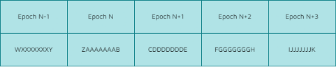

# Protocol Overview

Marinade was built with a simple architecture to facilitate liquid staking for the next billion users. This architecture also has the benefit of being easy to adapt if necessary and to operate in a permissionless way.&#x20;

Our code, our delegation strategy and our contracts are open source (or on the way to becoming it) and can be accessed freely. All our computations can be run on your own computer to verify any information.&#x20;

Marinade is also completely permissionless, meaning that our [bot](bot-operations.md) can be run by anyone in order to use the protocol.&#x20;

Let's review the different components of our protocol and how they interact together.&#x20;

## What can you do on Marinade?

Marinade offers different options:&#x20;

* Stake your SOL and receive [mSOL](msol-token.md).
* Deposit your stake account (if you are already delegating your SOL to a validator) and receive mSOL.
* Provide liquidity in our [mSOL/SOL pool](unstake-liquidity-pool.md) (in SOL exclusively) and earn fees generated when other users use the immediate unstake.&#x20;
* Unstake your mSOL, either immediatly (0.3% - 3% fees) or with a delay (no fees).&#x20;
* Earn MNDE by staking your mSOL or your mSOL/SOL LP.&#x20;


Our [DeFi page](https://marinade.finance/app/defi) also lists a number of options where mSOL can be used in DeFi. Feel free to check it out!&#x20;


### Stake SOL

When you choose to 'Stake', these operations happen under the hood:

1. You deposit SOL in the reserve account.
2. Marinade takes this amount and accordingly increases the amount of stake orders falling under:
   1. current epoch (epoch\_stake\_orders)
   2. total staked (total\_stake\_orders)
3. Marinade mints mSOL for the user according to mSOL/SOL ratio.

### Deposit an existing stake account

When you choose 'Deposit stake account', these operations happen under the hood:

1. Marinade finds the delegated-active-credit-observed stake accounts, delegated to any validator.
2. Marinade takes control of the delegated and fully active stake account by becoming staking and withdrawing authority.
3. Marinade takes this amount and accordingly increases the amount of stake orders falling under:
   1. current epoch (epoch\_stake\_orders)
   2. total staked (total\_stake\_orders)
4. Marinade mints mSOL for the user according to the mSOL/SOL ratio.


In order to be able to deposit your stake account, your validator must have a commission inferior to 30% and not be delinquent. Your stake account also needs to contain at least 1 SOL and be activated, which can take a few epochs.&#x20;


### Provide liquidity in the Unstake Liquidity Pool

You can only provide SOL to the Unstake Liquidity Pool. By doing this, you make your SOL available for users who want to use the 'Unstake now' function and you earn a share of the fees in exchange. You can learn more about our unstake liquidity pool on the following page:&#x20;


[unstake-liquidity-pool.md](unstake-liquidity-pool.md)


### Unstake now

When you choose 'Unstake now', these operations happen under the hood:

1. You transfer mSOL to Marinade.
2. Marinade performs a mSOL → SOL swap using the liquidity pool.
3. You get SOL according to the mSOL price and swap fee deducted.

.png>)


Using 'Unstake now' involves a variable fee (0.3% - 3%) depending on the available liquidity in the Unstake pool. In the current situation, your fees should never be more than 0.3%. You can learn more about it on the [Unstake liquidity pool](unstake-liquidity-pool.md) page.&#x20;


### Delayed unstake

When you choose 'Delayed unstake', these operations happen under the hood:

1. You are given a claim ticket (that will be a NFT issued on the blockchain) indicating the amount and due time of your unstake.
2. mSOL is burnt and removed from the supply.
3. The unstake operation is launched and performed by the bot.
4. At due time, you will be able to claim your SOL and destroy the claim ticket in exchange. (A claim ticket has no expiry date.)

This mechanism is required to perform larger unstake operations, when the amount is bigger than the current balance of the liquidity pool or if you do not mind waiting the unstaking period.

**Example of Delayed unstake at Epoch N:**&#x20;

Here are the **3** different situations that can happen when you use ‘Delayed unstake’ during epoch N.

* **You start unstaking during Z**, which is the very beginning of epoch n (like a few minutes into epoch n).

You will receive your SOL at the beginning of epoch n+1. The amount of SOL you receive is computed as `SOL = [mSOL to burn]*[mSOL price]` when the unstaking starts, but **mSOL price may not be updated** as the Marinade bot needs to be run to update the price at the beginning of each epoch. _We suggest waiting a few hours into the epoch before using 'Delayed unstake' and starting it before the last 4 hours of the epoch._

* **You start unstaking during A**.

You will receive SOL at the beginning of epoch n+1. The amount computed is `[mSOL to burn]*[mSOL price]` when the unstaking starts.

* **You start unstaking during B**, which is the last 4 hours of epoch n.

You will receive SOL at the beginning of epoch n+2. The amount computed is `[mSOL to burn]*[mSOL price]` when the unstaking starts.


An [epoch](../../faq/glossary.md#epoch) lasts approximately 2 days on the Solana blockchain. You can follow the progress of the current epoch directly on [Marinade](https://marinade.finance/app/staking).

