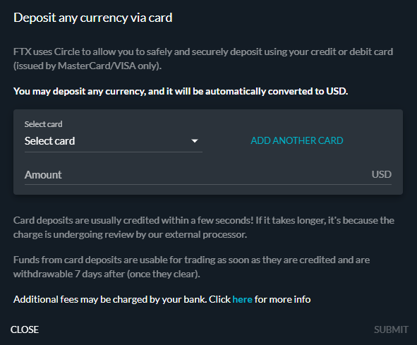

# 如何購買 SOL

## 1. 找到合適的交易所

為了購買加密貨幣，你需要在稱為交易所的平台上創建一個帳戶。 根據你的居住地，存在多種選擇。 以下是一些交易所的列表，你可以在其中創建帳戶並購買 SOL：

* [Binance](https://www.binance.com/en)
* [Bithumb](https://en.bithumb.com)
* [Coinbase](https://www.coinbase.com)
* [FTX](https://ftx.com)
* [Huobi](https://www.huobi.com/en-us/)
* [Kraken](https://www.kraken.com)
* [Kucoin](https://www.kucoin.com)
* [OKX](https://www.okex.com)

可以在此處找到市場列表： [Coingecko](https://www.coingecko.com/en/coins/solana#markets)&#x20;


在選擇交易所之前，請務必自己研究。 他們將提供不同的服務和費用，並且並非在所有國家都可以使用。 儘管如此，你應該可以在任何國家/地區購買 SOL。


## 2. 創建你的帳戶


我們將使用 FTX.com 作為此教學的範例，但大多數交易所都需要相同的步驟才能購買 SOL。 如果你發現自己在任何時候遇到麻煩，請前往我們的 [Discord](https://discord.com/invite/6EtUf4Euu6)，我們會為你提供幫助。


為了創建你的帳戶，你需要提供一個電子郵件地址並選擇一個安全密碼。 確保盡可能啟用 2FA（雙重要素驗證）。

然後，你必須通過提供以下內容來完成 KYC（了解你的客戶）：&#x20;

* 你的全名
* 你的居住國家
* 你所在的州、省或地區
* 你的生日
* 有效的電話號碼

此列表並非全部，不同的交易所可能會要求提供其他資訊。 一些交易所小額交易不需要 KYC 就可以進行。

完成後（這可能需要幾分鐘到幾天，具體取決於你使用的交易所），你的帳戶將被驗證。 你將能夠將法定貨幣（美元、歐元等）存入你的帳戶或直接購買加密貨幣。

## 3. 購買 SOL

### 3.1 - 直接購買

一些交易所允許你使用信用卡或銀行轉帳直接購買加密貨幣。 例如: 幣安就是這種情況。 在這種情況下，你只需輸入要花費的金額，就會出現一個付款視窗。

### 3.2 - 兌換 SOL

在其他交易所，你可能無法直接購買 SOL。 首先，你必須將法定貨幣存入你的帳戶。

找到你的錢包，將錢存入你選擇的交易所。 如果你使用 FTX，則可以通過點擊你的用戶名訪問你的錢包，並且你能使用信用卡付款。

你現在已經將美元存入你的 FTX 帳戶。 你可以使用錢包中美元餘額旁邊的“兌換”按鈕將其轉換為 SOL。 如果你同意價格並點擊“兌換”，你的美元將轉換為 SOL，你可以自由交易或發送到另一個錢包。

### 3.3 - 其他情況

一些交易所不允許你直接用法定貨幣購買 SOL。

如果是這種情況，你將需要找到可以在交易所交易 SOL 的第三種加密貨幣。 在大多數情況下，你將能夠把你的法定貨幣轉換或交易為穩定幣（USDT、USDC、BUSD 等），並使用該穩定幣在交易所購買 SOL。 這將不會有任何問題，這只意味著你將需要再進行一次交易。

在做出選擇之前，請務必在你使用的交易所檢查哪些加密貨幣可以兌換為 SOL。

## 4. 歡迎加入 Solana 網路

恭喜! 你現在已經購買了你的第一個 SOL！ 是時候去[Marinade](https://marinade.finance/app/staking)的廚房進行質押了，但為此，你需要創建自己的保管錢包。

如果你想了解更多有關 Solana 的資訊，請查看他們的[文件](https://docs.solana.com/introduction)。


當你在交易所購買加密貨幣時，平台會保證它是你的，但你無法完全控制它。 例如: 如果交易所倒閉，你可能無法收回資金。 如果你想完全控制你的資金（並在 DeFi 中使用它們），你需要將它們轉移到一個託管錢包中。

