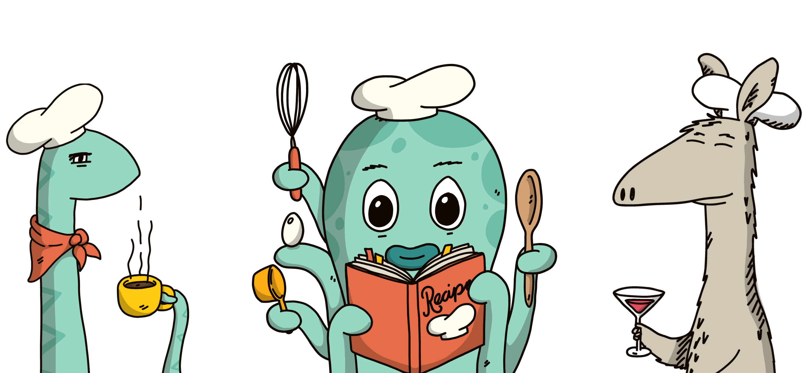

# Marinade Press Kit

## Marinade logo

.png>)


Contains full logo, icon and wordmark in both dark and white. File formats: png, svg.


## Token logos


File formats: png, svg.


## Illustrations

Our lead artist has designed a bunch of illustrations to fit every situation, feel free to use them everywhere!&#x20;



### Stickers

We also have Marinade stickers available for [Telegram](https://t.me/addstickers/MarinadeFinance) for you to have fun with!



## Fonts

Here are the two main fonts used on Marinade:&#x20;





## Download our kit

If you think you'll need all of those, we have prepared a full kit to download and use as you wish!&#x20;


